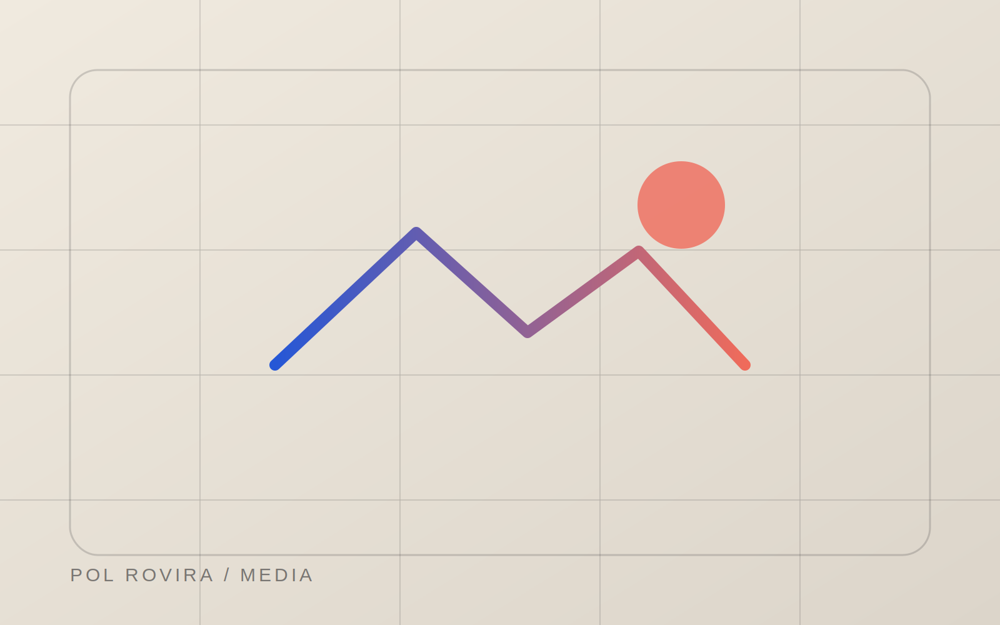

# Pol Rovira Portfolio

A responsive, single-page portfolio website for Pol Rovira, a multidisciplinary game developer focused on gameplay systems, interactive storytelling, visual development, and practical web products.

The website presents selected games, academic projects, personal applications, pixel-art work, and low-poly 3D studies. Each portfolio item can open an in-page case study with its own visual theme, media, project summary, process breakdown, and supporting details.

The project is built with semantic HTML, modern CSS, and vanilla JavaScript. It does not require a framework, package manager, bundler, database, or backend service.

## Table of Contents

- [Project Overview](#project-overview)
- [Main Features](#main-features)
- [Technology Stack](#technology-stack)
- [Project Structure](#project-structure)
- [Getting Started](#getting-started)
- [How the Website Works](#how-the-website-works)
- [Portfolio Sections](#portfolio-sections)
- [Case Study System](#case-study-system)
- [JavaScript Behaviour](#javascript-behaviour)
- [Styling System](#styling-system)
- [Accessibility](#accessibility)
- [Performance Considerations](#performance-considerations)
- [Content and Asset Management](#content-and-asset-management)
- [Customisation Guide](#customisation-guide)
- [Deployment](#deployment)
- [Browser Support](#browser-support)
- [Troubleshooting](#troubleshooting)
- [License](#license)

## Project Overview

This repository contains a complete portfolio experience designed around the relationship between technical systems and visual presentation.

The homepage introduces the developer and organises the work into several categories:

- Selected original projects
- Master’s degree projects
- Personal web products
- Visual experiments and playground work
- Professional profile, capabilities, and education
- Contact and external profile links

Instead of navigating to separate HTML pages, project details are stored directly in the main document and displayed as accessible modal-style overlays. This approach keeps navigation immediate while still allowing every case study to have a shareable hash-based URL.

Examples of supported project URLs include:

```text
#/portfolio/shotgun
#/portfolio/soma
#/portfolio/bookverse
#/portfolio/power-app
#/portfolio/weekly-meal-planner
```

## Main Features

### Responsive single-page layout

The page adapts across desktop, tablet, and mobile breakpoints. Large editorial grids progressively collapse into simpler one-column layouts while preserving the visual hierarchy and reading order.

### Interactive project case studies

Portfolio cards open detailed overlays containing project information such as:

- Project overview
- Role and team size
- Tools and technology
- Development time frame
- Design goals
- Technical challenges
- Process sections
- Screenshots, videos, GIFs, or model views
- Outcome and possible next steps

### Hash-based deep linking

Project overlays use URL hashes in the following format:

```text
#/portfolio/project-slug
```

This makes individual case studies directly addressable without creating separate pages or introducing a routing library.

### Dynamic navigation state

The primary navigation automatically highlights the section currently visible in the viewport.

### Scroll-based visual effects

The interface includes:

- Reveal-on-scroll transitions
- A header state that changes after scrolling
- A back-to-top button that appears after sufficient page progress
- Dynamic background atmospheres in the selected-work section
- A progress bar inside longer case studies

### Viewport-aware media

Videos play only when appropriate and are paused when they leave the viewport, when a case study closes, or when the browser tab becomes hidden.

Animated images are also loaded only near the viewport. When reduced motion is enabled, the website keeps their static fallback images instead.

### Media fallbacks

Images can define a `data-fallback` path. If an image fails to load, JavaScript replaces it with the configured placeholder asset.

### 3D media switcher

The hoverbike case study uses a media switcher that preloads and replaces the displayed model image while updating the active control state and alternative text.

## Technology Stack

The portfolio deliberately uses a lightweight, dependency-free frontend stack.

| Layer | Technology |
| --- | --- |
| Markup | HTML5 |
| Styling | CSS3 |
| Behaviour | Vanilla JavaScript |
| Typography | Google Fonts |
| Media | WebP, PNG, SVG, GIF, MP4, ICO |
| Hosting | Any static hosting provider |

The loaded typefaces are:

- Space Grotesk for primary interface and display text
- Newsreader for expressive italic accents
- IBM Plex Mono for metadata, labels, and technical information

No npm installation or production build is required.

## Project Structure

The source files reference the following recommended directory structure:

```text
.
├── index.html
├── README.md
├── resume.pdf
└── assets
    ├── css
    │   └── style.css
    ├── js
    │   └── main.js
    └── images
        ├── common
        │   ├── favicon.ico
        │   ├── media-placeholder.svg
        │   └── profile.png
        ├── games
        │   ├── shotgun
        │   ├── soma
        │   ├── mecha
        │   ├── monkey-island
        │   └── mario
        ├── webapps
        │   ├── power-app
        │   ├── weekly-meal-planner
        │   └── bookverse
        ├── pixel-art
        │   ├── sentient
        │   ├── fantasy
        │   └── thriller
        └── 3d
            ├── hoverbikes
            ├── malenia
            └── pokeitems
```

The supplied files may be stored at the repository root while being reviewed, but the HTML currently expects the stylesheet and script at these paths:

```text
assets/css/style.css
assets/js/main.js
```

Either place the files in those directories or update the corresponding `<link>` and `<script>` elements in `index.html`.

## Getting Started

### 1. Clone or download the project

```bash
git clone <repository-url>
cd <repository-directory>
```

### 2. Check the asset paths

Make sure the following files exist in the locations referenced by `index.html`:

```text
assets/css/style.css
assets/js/main.js
assets/images/...
resume.pdf
```

Missing images will use the configured placeholder where possible, but missing video files, the résumé, or incorrectly organised directories will still produce broken links or incomplete content.

### 3. Start a local web server

Although the site does not need compilation, it is better to serve it through HTTP instead of opening `index.html` directly with a `file://` URL.

Using Python:

```bash
python3 -m http.server 8000
```

Using Node.js and `serve`:

```bash
npx serve .
```

Then open:

```text
http://localhost:8000
```

### 4. Test the main interactions

Verify that:

- The mobile menu opens and closes
- Navigation links scroll to the correct sections
- Portfolio cards open their matching case studies
- The Escape key closes an open case study
- Browser Back closes a case study opened from the page
- Direct project hashes open the correct case study
- Videos and animated images load correctly
- External links and the résumé open successfully

## How the Website Works

The site follows a progressive-enhancement approach:

1. `index.html` contains all visible page content and every case study.
2. `style.css` defines the full responsive layout, component system, project themes, and motion preferences.
3. `main.js` adds navigation state, reveal effects, media control, modal behaviour, history integration, focus management, and error fallbacks.

The page remains structurally meaningful without JavaScript, but JavaScript is required for opening the hidden project-detail overlays and for most interactive enhancements.

## Portfolio Sections

### Hero

The introductory section includes:

- Availability status
- Professional role
- Name and positioning statement
- Short personal introduction
- Links to selected work and the résumé
- Featured Shotgun Battle Grid media

### Selected Work

The selected-work section highlights three projects:

- Shotgun Battle Grid
- SOMA
- Bookverse

As each featured card enters the central viewport area, JavaScript changes the section atmosphere through a `data-active-atmosphere` value. CSS uses that value to display project-specific gradients and background tones.

### Master’s Projects

This section presents focused academic exercises:

- Mecha Fight
- Monkey Island Fight
- Super Mario Bros recreation

Each project is described as a targeted study in areas such as physics, dialogue systems, movement, collision, level rhythm, and technical recreation.

### Personal Products

This section presents complete web applications built around real personal workflows:

- Power App
- Weekly Meal Planner

The case studies include links to live products or source code where those links are available in the HTML.

### Playground

The playground contains visual-development and production studies:

- Sentient
- Fantasy Characters
- Thriller Cast
- Hoverbikes
- Malenia’s Helmet
- Pokéitems

Several cards use static placeholders initially and replace them with animated GIFs only when they approach the viewport.

### About

The about section includes:

- Portrait and location
- Professional summary
- Current work and education context
- Contact email
- Technical and creative capabilities
- Education history

### Contact Footer

The footer provides:

- A primary email call to action
- Résumé link
- GitHub link
- LinkedIn link
- Instagram link
- Automatically updated copyright year

## Case Study System

### HTML structure

Every case study is a section with an ID that follows this convention:

```html
<section id="project-detail-example" class="project-detail" hidden>
  ...
</section>
```

A trigger opens the case study when its `data-project` value matches the suffix of the detail ID:

```html
<article data-project="example" role="button" tabindex="0">
  ...
</article>
```

The matching detail element must therefore be:

```html
<section id="project-detail-example">
  ...
</section>
```

### Supported project identifiers

The current document defines the following case-study identifiers:

```text
shotgun
soma
bookverse
mecha
monkey
mario
power-app
weekly-meal-planner
sentient
bookcharacters
thrillercharacters
hoverbikes
malenia-helmet
pokeitems
```

### Opening a case study

When a trigger is activated, JavaScript:

1. Finds the matching project detail.
2. Stores the element that previously had focus.
3. Makes the detail section visible.
4. Locks background page scrolling.
5. Marks the rest of the page as inert and hidden from assistive technology.
6. Resets the detail panel scroll position.
7. Starts the relevant video when motion preferences allow it.
8. Moves focus to the close control.
9. Pushes a hash-based history entry.

### Closing a case study

A project can be closed by:

- Selecting a close or back button
- Pressing Escape
- Clicking the overlay background
- Navigating back in browser history

After closing, focus returns to the element that opened the project whenever possible.

### Direct links

A URL such as the following opens the relevant project automatically:

```text
https://example.com/#/portfolio/shotgun
```

Direct-entry history is handled differently from in-page navigation so closing the case study does not incorrectly navigate away from the site.

### Focus trapping

While a project detail is open, Tab and Shift+Tab remain inside the active overlay. This prevents keyboard focus from moving into visually hidden background content.

### Scroll progress

Long case studies can include:

```html
<div class="detail-progress" aria-hidden="true">
  <span></span>
</div>
```

JavaScript calculates the detail panel’s current scroll position and updates the bar width from 0 to 100 percent.

## JavaScript Behaviour

All functionality is wrapped in an immediately invoked function expression and uses strict mode to avoid leaking variables into the global scope.

### Header and back-to-top state

A throttled scroll handler uses `requestAnimationFrame` to:

- Add `is-scrolled` to the fixed header after 20 pixels
- Show the back-to-top control after approximately 75 percent of one viewport height

### Mobile navigation

The menu button:

- Updates `aria-expanded`
- Changes its accessible label between open and close states
- Toggles the navigation panel
- Closes after selecting a navigation link
- Closes when clicking outside the menu
- Closes when pressing Escape

### Active section tracking

An `IntersectionObserver` watches main sections and the footer. The most visible region determines which navigation link receives the `is-active` class.

### Reveal transitions

Elements with the `.reveal` class are observed once. When they become visible, the script adds `.is-visible` and stops observing them.

### Selected-project atmosphere

Featured project cards are observed separately. The most visible card updates the selected-work section’s `data-active-atmosphere` attribute.

### Video playback

The helper `setVideoState()` respects the user’s reduced-motion preference.

Viewport videos:

- Play when sufficiently visible
- Pause when no longer visible
- Pause when reduced motion is enabled
- Pause when the document becomes hidden
- Resume conditionally when visibility returns

### Animated image loading

Images with `data-animated-src` keep their original source as `data-static-src`. An observer swaps between the static and animated files depending on visibility and motion preferences.

Example:

```html

```

### Image fallbacks

Every image can provide a fallback source:

```html

```

When the original source fails, JavaScript applies the fallback only once to avoid an error loop.

### Poster validation

Videos with `data-poster-src` validate the desired poster image before assigning it. This avoids replacing an existing working poster with a missing file.

### Media switching

A container with `data-media-switcher` can include:

- One image marked with `data-media-image`
- Multiple controls marked with `data-media-src`

When a control is selected, the target image is preloaded, the active state is updated, `aria-pressed` is synchronised, and the displayed alternative text is replaced with the button’s `data-media-alt` value.

### Current year

The footer year is generated at runtime:

```javascript
document.getElementById("current-year").textContent = String(new Date().getFullYear());
```

## Styling System

### Design tokens

The root selector defines reusable custom properties for:

- Background and paper tones
- Text colours
- Accent colours
- Borders
- Content width
- Header height
- Border radii
- Shadows
- Timing functions
- Font families

Example:

```css
:root {
  --paper: #f3eee5;
  --ink: #1d1d20;
  --cobalt: #2557d6;
  --coral: #ef6b5b;
  --content: 1280px;
  --header-height: 78px;
}
```

Changing these variables is the fastest way to modify the overall visual identity.

### Component classes

The stylesheet is organised around reusable classes for:

- Buttons
- Section headings
- Project cards
- Study cards
- Product cards
- Playground cards
- Project-detail overlays
- Galleries
- Notes and metadata
- Navigation and footer controls

### Project-specific themes

Each case study can define its own theme by overriding custom properties on a modifier class.

For example:

```css
.project-detail--shotgun {
  --bg: #06111e;
  --yellow: #48e5ff;
  --orange: #ff56b5;
}
```

The shared project-detail components then inherit those colours without requiring separate component rules for every project.

### Responsive breakpoints

The stylesheet uses the following principal breakpoints:

```text
1120px
900px
700px
480px
```

They control navigation behaviour, grid columns, project-card orientation, modal layouts, galleries, typography, and button sizing.

### Reduced motion

The `prefers-reduced-motion: reduce` media query:

- Disables smooth scrolling
- Reduces transition and animation durations
- Makes reveal elements immediately visible
- Hides the hero video

JavaScript also reads the same preference and prevents automatic media playback.

## Accessibility

The website includes several accessibility-oriented implementation details.

### Semantic landmarks

The document uses semantic elements such as:

- `header`
- `nav`
- `main`
- `section`
- `article`
- `figure`
- `footer`

### Skip link

A keyboard-accessible skip link allows users to move directly to the main content.

### Keyboard-operable project cards

Interactive cards use `role="button"` and `tabindex="0"`. JavaScript opens them with Enter or Space as well as pointer input.

### Accessible dialogs

Project details use:

- `role="dialog"`
- `aria-modal="true"`
- `aria-labelledby`
- `aria-hidden`
- Focus movement on open
- Focus restoration on close
- Focus trapping while open
- Escape-key dismissal

### Background isolation

While a case study is active, the main page regions receive both `inert` and `aria-hidden="true"`, preventing accidental interaction with content behind the overlay.

### Visible focus states

The stylesheet defines strong `:focus-visible` outlines for general controls and project-detail controls.

### Alternative text

Content images include descriptive `alt` attributes. Decorative images use empty alternative text where appropriate.

### Motion preferences

Both CSS and JavaScript respect `prefers-reduced-motion`.

### Important implementation note

Cards implemented as non-button elements with `role="button"` are keyboard supported by the script. For future extensions, native `<button>` or `<a>` elements may still be preferable when their semantics fit the interaction, because they provide built-in keyboard and form behaviour.

## Performance Considerations

The project includes several measures intended to reduce unnecessary work and network usage:

- Most non-critical images use `loading="lazy"`
- Images use `decoding="async"`
- The hero image uses `fetchpriority="high"`
- Videos use `preload="metadata"` or `preload="none"`
- Viewport videos pause when not visible
- Animated GIFs are not loaded until near the viewport
- Scroll updates are throttled with `requestAnimationFrame`
- `IntersectionObserver` replaces continuous scroll calculations for most visibility behaviour
- Media switcher images are preloaded before display
- Failed images fall back to a shared placeholder

For further optimisation, consider:

- Compressing large PNG and GIF files
- Replacing GIF animation with MP4 or WebM where suitable
- Providing multiple image sizes through `srcset`
- Self-hosting fonts if privacy or offline use is important
- Adding long-term cache headers in production
- Running an image audit before deployment

## Content and Asset Management

### Updating personal information

Edit the following areas in `index.html`:

- Document title and description
- Hero introduction
- Availability message
- About text
- Email address
- Social profile links
- Education entries
- Footer call to action

### Updating the résumé

Replace `resume.pdf` in the project root or change every résumé link to the correct path.

### Replacing images

When replacing an image:

1. Keep the same file path, or update the `src` attribute.
2. Update the `alt` text so it describes the new content.
3. Set an appropriate width and height where practical.
4. Keep or update the `data-fallback` path.
5. Compress the asset before deployment.

### Replacing videos

Update the `<source>` path or video `src`. Keep poster images available so users see meaningful content before playback begins or when reduced motion is enabled.

### Adding a new portfolio card

Create a trigger with a unique `data-project` value:

```html
<article data-project="new-project" role="button" tabindex="0">
  ...
</article>
```

Then create a matching case study:

```html
<section
  id="project-detail-new-project"
  class="project-detail project-detail--new-project"
  role="dialog"
  aria-modal="true"
  aria-hidden="true"
  aria-labelledby="project-title-new-project"
  hidden
>
  ...
</section>
```

The slug must match exactly in both locations.

### Adding a new case-study theme

Define a modifier class that overrides the shared project variables:

```css
.project-detail--new-project {
  --bg: #10131a;
  --bg-deep: #080a0f;
  --surface: #181d27;
  --text: #f5f5f2;
  --text-soft: rgba(245, 245, 242, 0.72);
  --yellow: #8fcaff;
  --yellow-soft: #d9ecff;
  --orange: #ff7d6d;
  --line: rgba(255, 255, 255, 0.13);
}
```

## Customisation Guide

### Change the global colour palette

Edit the colour custom properties in `:root`.

### Change the content width

Update:

```css
--content: 1280px;
```

### Change the typography

1. Replace or remove the Google Fonts request in `index.html`.
2. Update the font variables in `:root`:

```css
--font-display: ...;
--font-serif: ...;
--font-mono: ...;
```

### Change section order

Move entire section blocks within `<main>`. Keep navigation links and section IDs synchronised.

### Change navigation items

Navigation links must target an existing section ID:

```html
<a href="#about">About</a>
```

The active-section observer automatically includes sections inside `main` and the footer when they have an ID.

### Change animation intensity

Adjust the transition values on `.reveal`, card hover states, and the shared `--ease` variable. Keep the reduced-motion rules in place.

## Deployment

Because the project is static, it can be deployed to services such as:

- GitHub Pages
- Netlify
- Cloudflare Pages
- Vercel
- Any standard web server

### GitHub Pages

A typical deployment requires only the repository contents and correctly committed assets.

Ensure that:

- File and directory names match their case-sensitive references
- `index.html` is at the published root
- Asset paths are relative and valid
- `resume.pdf` is included
- Large media files remain within platform limits

Hash-based project URLs work well on static hosting because they do not require server-side route rewriting.

### Deployment checklist

Before publishing:

- Validate the HTML
- Check the browser console for errors
- Test all project cards
- Test direct hash URLs
- Test keyboard navigation
- Test reduced-motion mode
- Test at mobile, tablet, and desktop widths
- Confirm all external links
- Confirm the email address
- Confirm the résumé path
- Compress heavy assets
- Run a performance and accessibility audit

## Browser Support

The implementation relies on modern browser features, including:

- CSS custom properties
- CSS Grid and Flexbox
- `IntersectionObserver`
- `requestAnimationFrame`
- `matchMedia`
- History API
- `inert`
- Optional chaining
- `color-mix()` in project-detail styling

Current versions of Chrome, Edge, Firefox, and Safari are the intended targets.

Older browsers may need polyfills or fallbacks, especially for `inert`, `color-mix()`, and some newer CSS text-wrapping properties.

## Troubleshooting

### The page has no styling

Confirm that `style.css` is available at:

```text
assets/css/style.css
```

If the file remains at the repository root, change the HTML reference to:

```html
<link rel="stylesheet" href="style.css">
```

### Interactive elements do not work

Confirm that `main.js` is available at:

```text
assets/js/main.js
```

Also check the browser console for JavaScript errors.

### A project card does not open

Check that:

- The trigger has a `data-project` value
- A detail section exists with `id="project-detail-{value}"`
- The two slugs match exactly
- No duplicate IDs exist

### A direct case-study URL does not open

The expected pattern is:

```text
#/portfolio/project-slug
```

The project slug must contain only letters, numbers, and hyphens to match the current regular expression.

### Images show placeholders

The original image path is probably missing or incorrect. Check:

- Exact filename
- File extension
- Letter casing
- Relative directory
- URL-encoded spaces in filenames

### A GIF never animates

Check that:

- `data-animated-src` is present
- The animated asset exists
- Reduced motion is not enabled
- The image is close enough to the viewport

### A video does not autoplay

Autoplay behaviour depends on browser policy. The supplied videos are muted and use `playsinline`, which improves compatibility, but playback may still be blocked in some contexts. The script safely ignores rejected play promises.

Also verify that reduced motion is not enabled, because automatic playback is intentionally disabled in that mode.

### The résumé link is broken

Place `resume.pdf` at the root of the published site or update the résumé links to the actual location.

### Layout problems appear only after deployment

Static hosts are usually case-sensitive. A path that works locally may fail online if the filename casing differs from the HTML reference.

## License

No explicit software or content license is defined in the supplied files.

Before redistributing or reusing this portfolio, add a licence that clearly distinguishes between:

- Source code
- Personal text and branding
- Screenshots and videos
- Original game artwork
- Fan studies or recreations based on third-party intellectual property

Unless a licence is added, standard copyright restrictions apply.
